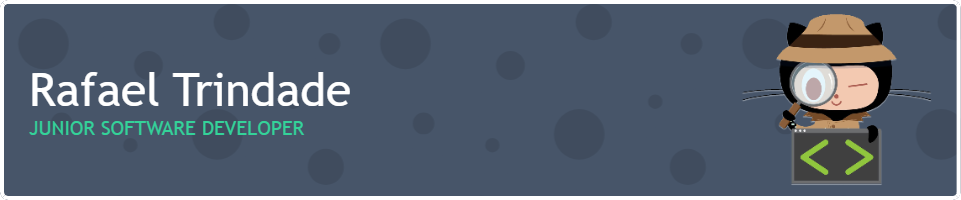

## Hi there 👋

 🚀 About Me 
I'm Rafael Junior Software Developer from Portugal  that enjoys solving problems and learning new things I also enjoy wireframing, ui, ux, and design in general.

 ⚙️ Technical Skills 

 

💼 Professional Opportunities 
Currently i'm looking for new challenges and opportunities that makes me feel on a continous learning. I prefer projects based on JavaScript (React, TypeScript, NodeJS, etc.), but I am always open to new challenges that may involve other technologies.

🌱 I’m currently learning **NextJS**
